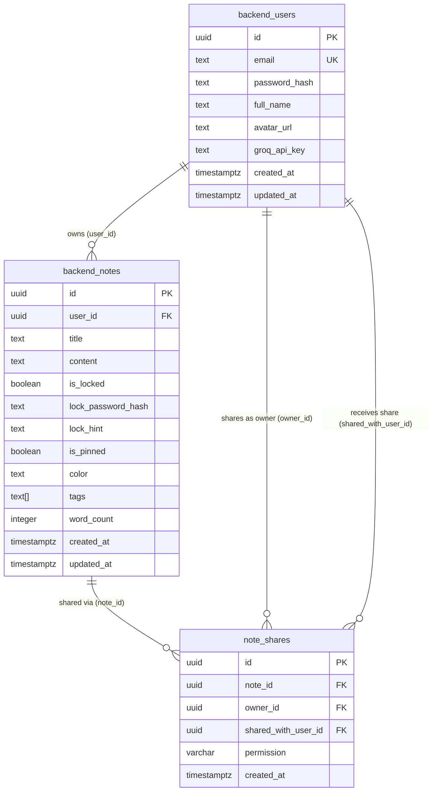
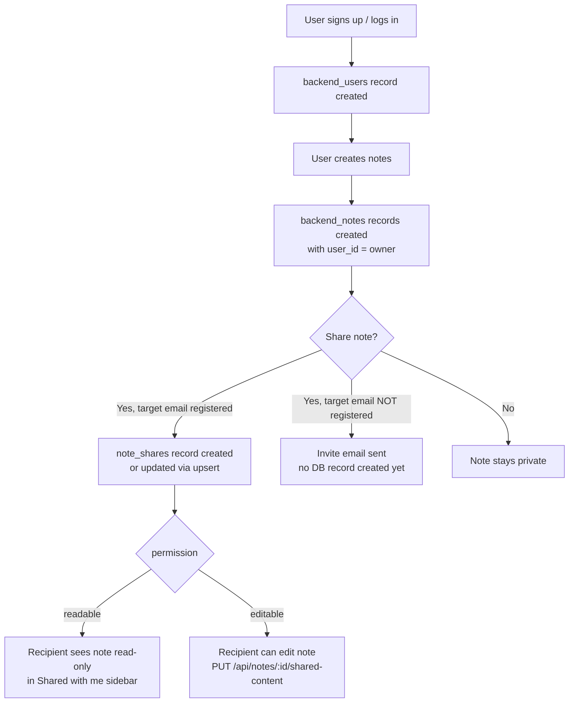

# Database Schema — NoteGenius AI

This document describes how the database tables connect together.

## Run Order

1. `SUPABASE_SETUP.sql` — Supabase-native tables (profiles, notes using Supabase Auth)
2. `BACKEND_SETUP.sql` — Python backend tables (backend_users, backend_notes)
3. `NOTE_SHARES_MIGRATION.sql` — Note sharing table (depends on backend_users and backend_notes)

---

## Entity Relationship Diagram

---

## Relationship Summary

| Relationship | From | To | Type | Description |
|---|---|---|---|---|
| owns | backend_users | backend_notes | one-to-many | A user owns zero or many notes |
| shared via | backend_notes | note_shares | one-to-many | A note can be shared with multiple users |
| shares as owner | backend_users | note_shares | one-to-many | A user can share many of their notes |
| receives share | backend_users | note_shares | one-to-many | A user can receive many shared notes |

---

## Constraints

- `backend_notes.user_id` — CASCADE DELETE: deleting a user removes all their notes
- `note_shares.note_id` — CASCADE DELETE: deleting a note removes all its share records
- `note_shares.owner_id` — CASCADE DELETE: deleting a user removes all shares they created
- `note_shares.shared_with_user_id` — CASCADE DELETE: deleting a user removes all shares they received
- `note_shares.(note_id, shared_with_user_id)` — UNIQUE: a note can only be shared once per recipient (re-sharing updates the permission via upsert)
- `note_shares.permission` — CHECK: must be `'readable'` or `'editable'`

---

## Data Flow

